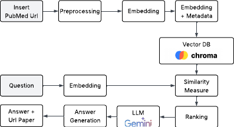
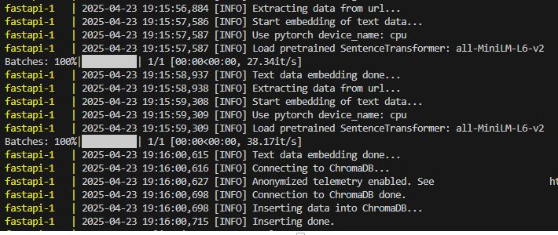

# PubMed_RAG_LLM
Retrieval Augmented Generation (RAG) for Document Retrieval and Question Answering of PubMed papers. Takes as input a PubMed Url and inserts it into the vector DB ChromaDB. It also takes a question as query input, retrieves context and generates the answer via Gemini with the url of the paper. 

## Architecture


## Project Structure
```
.
├── README.md
├── Dockerfile
├── docker-compose.yml
├── architecture_pubmed_rag.png
├── requirements.txt
├── src
│   └── classes
        └── AnswerLLMClass.py
        └── DatabaseChromaDBClass.py
        └── ExtractPubMedDataClass.py
        └── SimilarityMetricClass.py
    └── main.py
```
## Prerequisites
* Google Cloud Vertex AI Credentials
* GCP Project
* Docker

## Start Project
`git clone https://github.com/Jess3210/PubMed_RAG_LLM.git`

`docker-compose up --build`

* First PubMed Papers will automatically be added at first start


* Use for example Postman API for:
  
**Insert** <br>
POST: http://localhost:7000/ingest/ <br>
Body: JSON
```
{
    "document": "https://pubmed.ncbi.nlm.nih.gov/15858239/"
}
```
Return: "OK"

**Question** <br>
POST: http://localhost:7000/query/ <br>
Body: JSON
```
{
    "query": "What are the various genes?"
}
```
Return:
```
{
    "question:": "What are the various genes?",
    "answer": "The genes involved in Hirschsprung disease are RET, EDNRB, GDNF, EDN3, SOX10, NTN3, and ECE1.\n",
    "url": "https://pubmed.ncbi.nlm.nih.gov/15858239/"
}
```
## Author <br>
Jessica Kick
